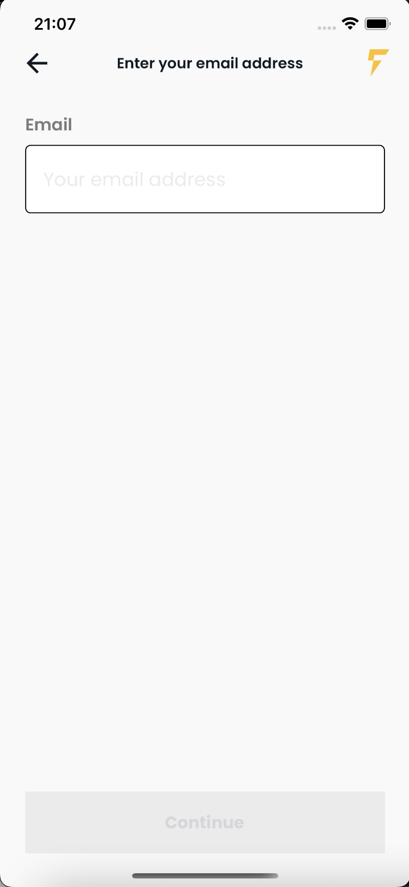

# Fast Bitcoins - Mobile App
  Developed a small application that calls dev environment api to register a new account or login to an existing account, monitors to store the session secret when the magic link has been visited in the new account email.


## Table of contents

  - [Table of contents](#table-of-contents)
  - [General info](#general-info)
  - [Main Technologies Used](#main-technologies-used)
  - [Features](#features)
  - [Screenshots](#screenshots)
  - [Setup](#setup)

## General info
This project was a technical challenge for Fast Bitcoins which I have created using React Native + Typescript. It is consuming a REST API provided by Fast Bitcoins to test it. I also used Redux Toolkit to state management. I have also used React Query to cache requests. 
	
## Main Technologies Used
- React - version 17.0.2
- React Native - version 0.68.2
- React Navigation - version 6
- Redux Toolkit - version 1.8.1
- React Query - version 3.39.1
- Jest - version 27.5.1
- React Native Testing Library - version 9.1.0

## Features

- Home which should be Select Language Screen
- Screen which validate email if it is registered or not
- New Account to choose country and state if country is United States
- Single property details screen

## Screenshots


<p float="left">



</p>

[Login flow](https://1drv.ms/v/s!Aq8pBcuu11X8lnXbmqJQy2rS6J27?e=5sgfdl)

[New account flow](https://1drv.ms/v/s!Aq8pBcuu11X8lnbmECJ0EebVwrk8?e=Uvj9pv)


	
## Setup

##### To run this project:

-  For iOS
You will need Node, Watchman, the React Native command line interface, Xcode and CocoaPods.

-  For Android
You will need Node, Watchman, the React Native command line interface, a JDK, and Android Studio.

[Setting up the environment following React Native doc instructions.](https://reactnative.dev/docs/environment-setup) 


##### Running your React Native application after have your setup ready: 

```bash
$ yarn 
$ yarn start
$ yarn android
$ npx pod-install && yarn ios
```
